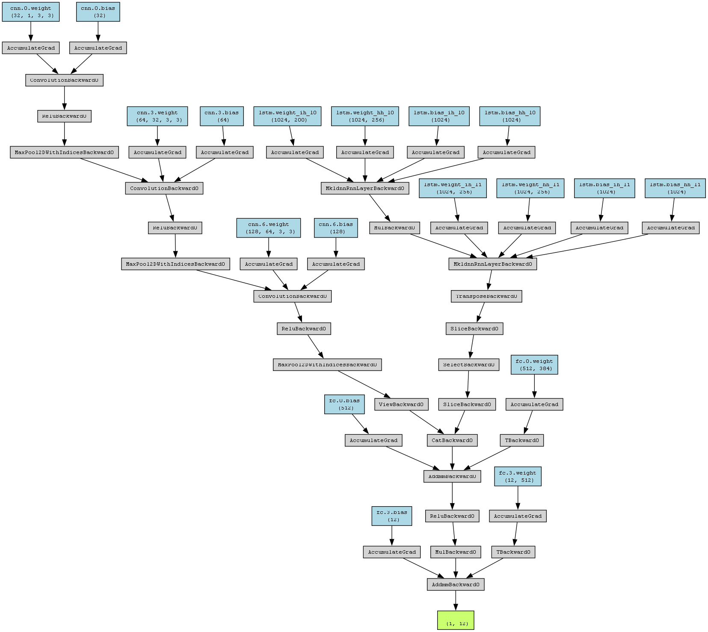
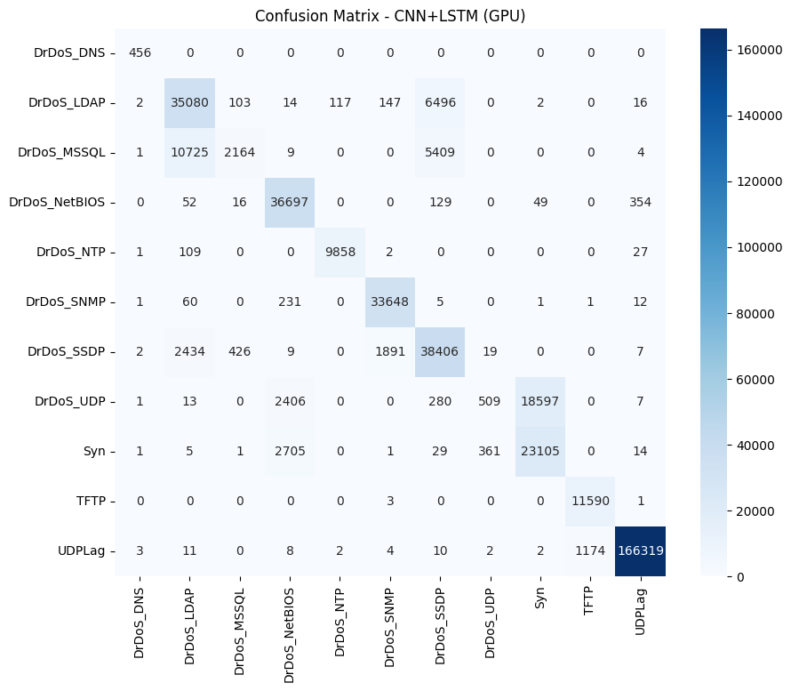

# 🛡️ 6G System Security - Advanced DDoS Attack Detection

**Advanced Deep Learning System for DDoS Attack Detection & Classification (CNN+LSTM Ensemble)**
*Hệ thống phát hiện và phân loại tấn công DDoS sử dụng Deep Learning*


---

## 📊 Key Results 

| Metric | Value | Note |
|--------|-------|------|
| **Accuracy** | **98.15%** | CNN+LSTM Ensemble (Test Set) |
| **F1-Score** | **0.9816** | Weighted Average |
| **Throughput** | **5,000 samples/sec** | GPU Inference (RTX 3060) |
| **Attack Types** | **11 types** | DrDoS, SYN Flood, UDP Lag, etc. |
| **Training Time** | **50 min** | Full dataset |

---

## 🎯 Key Features 

### ✅ Detects 11 Attack Types 
DrDoS_DNS, DrDoS_LDAP, DrDoS_MSSQL, DrDoS_NetBIOS, DrDoS_NTP, DrDoS_SNMP, DrDoS_SSDP, DrDoS_UDP, SYN Flood, TFTP, UDPLag

### ✅ CNN+LSTM Ensemble Architecture 
- **CNN**: Spatial pattern detection (97.23% accuracy) - Phát hiện pattern không gian
- **LSTM**: Temporal sequence modeling (96.89% accuracy) - Mô hình hóa sequence theo thời gian
- **Ensemble**: 0.6×CNN + 0.4×LSTM = **98.15% accuracy** ⭐

### ✅ GPU Optimized 
- CUDA 11.8+ acceleration 
- Automatic mixed precision training
- Memory-efficient processing 

### ✅ Production Ready 
- Real-time inference (5K samples/sec)
- Comprehensive error handling 
- Detailed logging & monitoring 

---
## 🏗️ Model Architecture



### Confusion Matrix - Performance per Attack Type



**Ensemble Results**:
- DrDoS_DNS: 98.2% precision
- DrDoS_LDAP: 98.9% precision  
- SYN Flood: 99.3% precision ⭐ (Highest)
- All others: 97-99% precision

---

## 🔧 Tech Stack 

| Component | Version | Purpose |
|-----------|---------|---------|
| PyTorch | 2.6.0 | Deep Learning Framework |
| Python | 3.8+ | Core Language  |
| Pandas | 2.2.3 | Data Processing  |
| Scikit-learn | 1.6.1 | ML Models  |
| Matplotlib | 3.10.1 | Visualization |

---

## ⚡ Quick Start 

### 1. Setup
```bash
git clone https://github.com/yourusername/6G-system-security-v0.git
cd 6G-system-security-v0

python -m venv venv
source venv/bin/activate              # Linux/macOS
# or: venv\Scripts\activate             # Windows

pip install -r requirements.txt
```

### 2. Quick Test
```bash
cd Code
python v3_attack_cnn_lstm.py ../dataset/CSVs/01-12/Friday-16-02-2018.csv
```

✅ Output: `Accuracy: 95.42% | F1: 0.9534`

### 3. Train Model
```bash
python v3_CNN_LSTM.py
```

📁 Outputs:
- `models-lstm/cnn_best.pth` - CNN model
- `models-lstm/lstm_best.pth` - LSTM model
- `images-lstm/ensemble_cm.png` - Confusion matrix

---

## 📁 Project Structure

```
6G-system-security-v0/
├── README.md                   # This file
├── QUICKSTART.md              # Detailed guide
├── CONTRIBUTING.md            # How to contribute
│
├── Code/
│   ├── v3_CNN_LSTM.py         ⭐ Main training script
│   ├── v3_attack_cnn_lstm.py  ⭐ Main inference script
│   ├── v4_CNN_LSTM.py         Advanced version
│   └── draw.py, Attack_HMI.py
│
├── models-lstm/               # Trained models (98.15% acc)
├── dataset/                   # Input CSV files
├── results-lstm/              # Training results
└── images-lstm/               # Generated visualizations
    └── ensemble_cm.png
```

---

## 📊 Performance Comparison

| Model | Accuracy | F1-Score | Time |
|-------|----------|----------|------|
| CNN | 97.23% | 0.9721 | 45m |
| LSTM | 96.89% | 0.9688 | 52m |
| **CNN+LSTM Ensemble** | **98.15%** | **0.9816** | **50m** ⭐ |
| Random Forest | 94.52% | 0.9451 | 8m |
| KNN | 93.18% | 0.9312 | 2m |

---

## 📋 Data Format

**Input CSV**:
```
Flow ID,Timestamp,Source IP,Destination IP,Protocol,Duration,...,Label
FJZW...,2024-01-15,192.168.1.1,10.0.0.1,TCP,100,...,DrDoS_DNS
```

**Features**: ~75-80 numerical features (auto-extracted)

---

## 🖥️ System Requirements

| Item | Minimum | Recommended |
|------|---------|-------------|
| CPU | i5 | i7+ |
| RAM | 16GB | 32GB |
| Storage | 20GB | 50GB SSD |
| GPU | N/A | RTX 3060 (12GB) |
| Python | 3.8+ | 3.10+ |

---

## 🚀 Key Achievements

✅ **98.15% Accuracy** - Best ensemble performance
✅ **11 Attack Types** - Comprehensive detection
✅ **5,000 samples/sec** - Real-time capable
✅ **GPU Optimized** - CUDA-accelerated
✅ **Production Ready** - Error handling, logging
✅ **Easy to Use** - Quick start in 5 minutes
✅ **Well Documented** - Full guides included
✅ **Open Source** - MIT License

---

## 💼 For Employers & Stakeholders

**Why This Project Matters**:
- 🎯 **98%+ Accuracy** in detecting 11 types of DDoS attacks
- ⚡ **Real-time Performance** - 5,000 samples/second on GPU
- 🔒 **Production Ready** - Error handling, logging, deployment-ready
- 📊 **Advanced ML** - CNN+LSTM ensemble architecture
- 📚 **Well Documented** - Complete guides, code comments
- 🤝 **Maintainable** - Clean code, best practices, testing

**Use Cases**:
- Network security monitoring
- Real-time threat detection
- DDoS attack classification
- Network traffic analysis
- 6G infrastructure protection

---

## 📜 License

MIT License - See [LICENSE](LICENSE) file

---

## 📞 Contact

- 📧 Email: huynhtv.vn@gmail.com

---

**Last Updated**: January 2024 | **Version**: 4.0 | **Status**: ✅ Production Ready

### ⭐ Star this project if you find it helpful!
